# METDC v2.0 - Multi-Exchange Trade Data Collector 🚀

**업비트 상장공고 기반 견고한 다중거래소 실시간 데이터 수집 시스템**

업비트 KRW 신규 상장공고를 트리거로 해외 6개 거래소의 spot/futures 마켓에서 -20초 구간 체결데이터를 **"무식하게 때려박기"** 방식으로 수집하는 고성능 실시간 시스템입니다.

## ✨ 핵심 기능

### 🎯 **스마트 트리거 시스템**
- **업비트 상장공고 실시간 감지**: Flash-upbit 검증된 5가지 패턴으로 상장공고 파싱
- **KRW 신규 상장만 감지**: 이미 상장된 코인들은 자동 필터링으로 효율성 극대화
- **-20초 정밀 타이밍**: 상장공고 감지 즉시 20초 전부터 20초 후까지 40초간 수집

### 💾 **견고한 다중거래소 아키텍처**
- **6개 해외거래소**: Binance, Bybit, KuCoin, OKX, Phemex, Gate.io
- **Spot/Futures 완전 분리**: 거래소당 2개 마켓 × 6거래소 = 12개 독립 슬라이스
- **WebSocket Task Manager**: 거래소별 독립 연결 관리, 자동 재연결, 에러 복구
- **연결 제한 관리**: 심볼 100개씩 분할, 쿨다운 적용으로 Rate Limit 회피

### 🔧 **견고한 WebSocket 관리**
- **독립적 연결 관리**: 각 거래소별 별도 WebSocket Manager 운영
- **Circuit Breaker**: 연속 실패시 임시 중단 후 지수 백오프로 재연결
- **Health Check**: 주기적 Ping/Pong으로 연결 상태 모니터링
- **Hard Reset**: 심각한 에러 발생시 전체 시스템 안전 재시작

### 🎯 **스마트 심볼 필터링**
- **YAML 기반 설정**: 구독할 심볼 목록을 YAML로 중앙 관리
- **자동 목록 갱신**: 프로그램 시작시 업비트 KRW 상장 코인 자동 제외
- **확장성**: 새로운 거래소 추가시 YAML 설정만으로 간편 확장

### 📊 **"무식하게 때려박기" 메모리 전략**
- **12개 독립 슬라이스**: 동시성 이슈 원천 차단을 위한 완전 분리
- **단순 축적**: 복잡한 최적화 없이 메모리에 순차 저장
- **배치 I/O**: 40초 수집 완료 후 1회 JSON 저장으로 I/O 최적화
- **명시적 정리**: 저장 완료 후 즉시 메모리 해제로 리소스 관리

### 🚀 **거래소별 심화 분석 시스템**
- **최초 펌프 감지**: 어느 거래소에서 가장 먼저 펌핑이 발생했는지 정확히 분석
- **거래소 비교**: 반응 속도, 활성도, 거래량을 기준으로 거래소별 순위 제공
- **사용자 행동 패턴**: 거래소별 사용자 특성 (조기/일반/후발 트레이더, 고액 거래자) 분석
- **Exchange Insights**: 각 거래소의 펌프 강도, 사용자 수, 평균 거래량 등 상세 통계

## 🏗️ 시스템 아키텍처

```mermaid
graph TB
    UP[업비트 모니터] --> TRG[이벤트 트리거]
    TRG --> WTM[WebSocket Task Manager]
    
    WTM --> B1[Binance Spot]
    WTM --> B2[Binance Futures]
    WTM --> BY1[Bybit Spot]
    WTM --> BY2[Bybit Futures]
    WTM --> K1[KuCoin Spot]
    WTM --> K2[KuCoin Futures]
    WTM --> O1[OKX Spot]
    WTM --> O2[OKX Futures]
    WTM --> P1[Phemex Spot]
    WTM --> P2[Phemex Futures]
    WTM --> G1[Gate Spot]
    WTM --> G2[Gate Futures]
    
    B1 --> MEM[메모리 수집기]
    B2 --> MEM
    BY1 --> MEM
    BY2 --> MEM
    K1 --> MEM
    K2 --> MEM
    O1 --> MEM
    O2 --> MEM
    P1 --> MEM
    P2 --> MEM
    G1 --> MEM
    G2 --> MEM
    
    MEM --> STORE[배치 저장기]
    STORE --> PUMP[펌프 분석기]
```



## 📂 프로젝트 구조

```
PumpWatch/
├── main.go                         # METDC v2.0 메인 엔트리포인트
├── config/
│   ├── config.yaml                 # 시스템 설정
│   └── symbols_config.yaml         # 심볼 구독 설정 (자동 갱신)
├── internal/
│   ├── models/                     # 데이터 모델
│   │   ├── collection_event.go     # 12개 독립 슬라이스 구조
│   │   ├── listing_event.go        # 상장 이벤트 모델
│   │   └── trade_event.go          # 거래 이벤트 모델
│   ├── config/                     # 설정 관리
│   │   └── config.go               # YAML 설정 로더
│   ├── monitor/                    # 업비트 모니터링
│   │   ├── upbit.go                # 상장공고 실시간 감지
│   │   └── parser.go               # Flash-upbit 5가지 패턴
│   ├── websocket/                  # WebSocket 관리 시스템
│   │   └── task_manager.go         # 12개 독립 연결 관리
│   ├── storage/                    # 데이터 저장
│   │   ├── manager.go              # 저장 매니저
│   │   └── signal_data_handler.go  # 펌프 시그널 데이터 처리
│   ├── analyzer/                   # 펌프 분석
│   │   └── analyzer.go             # 펌프 패턴 탐지 엔진
│   ├── cache/                      # 메모리 캐시
│   │   └── cache_manager.go        # "무식하게 때려박기" 캐시
│   ├── symbols/                    # 심볼 관리
│   │   ├── manager.go              # 심볼 필터링 및 관리
│   │   └── config.go               # 심볼 설정 구조체
│   └── sync/                       # 거래소 동기화
│       ├── symbol_sync.go          # 심볼 동기화
│       └── upbit_api.go            # 업비트 API 클라이언트
├── data/                           # 데이터 저장소
│   └── SYMBOL_TIMESTAMP/           # 예: TIA_20250904_143052/
│       ├── metadata.json           # 상장공고 메타데이터
│       ├── raw/                    # 거래소별 원시 데이터
│       │   ├── binance/
│       │   │   ├── spot.json       # 바이낸스 현물 체결데이터
│       │   │   └── futures.json    # 바이낸스 선물 체결데이터
│       │   ├── okx/
│       │   │   ├── spot.json       # OKX 현물 체결데이터
│       │   │   └── futures.json    # OKX 선물 체결데이터
│       │   └── ...                 # bybit, kucoin, phemex, gate
│       └── refined/                # 정제된 분석 데이터
│           ├── refined_analysis.json    # 전체 통합 분석 + 거래소 비교
│           ├── top_users.json           # 전체 최고 사용자들
│           ├── pump_events.json         # 탐지된 펌프 이벤트들
│           ├── summary.json             # 분석 요약
│           ├── analysis_metadata.json   # 분석 메타데이터
│           ├── binance/                 # 바이낸스 세부 분석
│           │   ├── analysis.json        # 바이낸스만의 분석
│           │   ├── top_users.json       # 바이낸스 최고 사용자
│           │   └── metadata.json        # 바이낸스 메타데이터
│           └── ...                      # okx, bybit 등 각 거래소별 분석
└── logs/                           # 시스템 로그
```

## 🚀 빠른 시작

### 1. 기본 설정

```bash
# 프로젝트 클론
git clone <repository>
cd PumpWatch

# Go 모듈 다운로드
go mod tidy

# 심볼 설정 초기화 (최초 실행 시)
go run main.go --config config/config.yaml --symbols config/symbols_config.yaml --init-symbols
```

### 2. 실행

```bash
# METDC v2.0 시작 (기본 설정)
go run main.go --config config/config.yaml --symbols config/symbols_config.yaml

# 또는 빌드 후 실행
go build -o metdc main.go
./metdc --config config/config.yaml --symbols config/symbols_config.yaml

# 로그 레벨 설정
./metdc --config config/config.yaml --symbols config/symbols_config.yaml --log debug
```

### 3. 모니터링

```bash
# 실시간 로그 확인
tail -f logs/metdc.log

# 메모리 사용량 모니터링
go tool pprof http://localhost:6060/debug/pprof/heap
```

## ⚙️ 설정

### config/config.yaml

```yaml
# METDC v2.0 System Configuration
server:
  host: "localhost"
  port: 8080
  timeout: "30s"

# Upbit monitoring settings
upbit:
  enabled: true
  api_url: "https://api-manager.upbit.com/api/v1/announcements"
  poll_interval: "5s"
  timeout: "10s"
  user_agent: "METDC-v2.0"

# Exchange WebSocket configurations
exchanges:
  binance:
    enabled: true
    spot_ws_url: "wss://stream.binance.com:9443/ws"
    futures_ws_url: "wss://fstream.binance.com/ws"
    reconnect_interval: "5s"
    max_retries: 10
  
  bybit:
    enabled: true
    spot_ws_url: "wss://stream.bybit.com/v5/public/spot"
    futures_ws_url: "wss://stream.bybit.com/v5/public/linear"
    reconnect_interval: "5s"
    max_retries: 10
    
  # ... 다른 거래소 설정

# Storage settings
storage:
  data_dir: "./data"
  raw_data_enabled: true
  analysis_enabled: true
  cleanup_after_days: 30

# Analysis settings
analysis:
  pump_threshold: 3.0  # 3% price increase threshold
  time_window_seconds: 1
  min_volume_ratio: 2.0
```

### config/symbols_config.yaml

```yaml
version: "2.0"
updated_at: "2025-09-04T23:00:00Z"

# 업비트 KRW 상장 코인들 (자동 갱신)
upbit_krw_symbols:
  - "BTC"
  - "ETH" 
  - "XRP"
  # ... 자동 갱신됨 (symbols manager에 의해)

# 거래소별 심볼 설정
exchanges:
  binance:
    symbols: ["TIAUSDT", "ADAUSDT", "SOLUSDT"]
    enabled: true
  bybit:
    symbols: ["TIAUSDT", "ADAUSDT", "SOLUSDT"] 
    enabled: true
  # ... 각 거래소별 심볼 목록 (업비트 KRW 제외됨)
```

## 🔧 핵심 기능

### WebSocket Task Manager
- **연결별 독립 관리**: 각 거래소의 Spot/Futures를 별도 태스크로 관리
- **Circuit Breaker**: 연속 5회 실패시 30초 쿨다운 적용
- **Exponential Backoff**: 재시도 간격을 1초 → 2초 → 4초 → 8초로 점진적 증가
- **Health Check**: 30초마다 Ping/Pong으로 연결 상태 확인

### Smart Symbol Filtering
- **업비트 KRW 제외**: 이미 상장된 코인들은 해외거래소에서 구독하지 않음
- **동적 갱신**: 프로그램 시작시 최신 업비트 상장 목록으로 자동 갱신
- **효율적 구독**: 불필요한 데이터 구독 최소화로 리소스 절약

### Hard Reset 기능
- **Critical Error 감지**: 복구 불가능한 에러 패턴 자동 인식
- **Safe Restart**: 모든 연결 정리 → 메모리 해제 → 설정 재로딩 → 연결 재시작
- **Rate Limiting**: 시간당 최대 3회 Hard Reset으로 무한 루프 방지

## 📊 성능 특징

### 메모리 사용량
- **32GB RAM 권장**: "무식하게 때려박기" 전략으로 충분한 메모리 필요
- **피크 사용량**: 상장공고당 약 2-4GB (40초간 12개 거래소 데이터)
- **자동 정리**: 데이터 저장 완료 후 즉시 메모리 해제

### 처리 성능
- **동시 연결**: 최대 12개 WebSocket 연결 (거래소별 Spot/Futures)
- **데이터 처리**: 초당 10만건 이상 체결 데이터 처리 가능
- **레이턴시**: 상장공고 감지부터 데이터 수집 시작까지 3초 이내

### 안정성
- **99.9% 가용성**: Circuit Breaker와 자동 재연결로 높은 안정성
- **데이터 무손실**: 배치 저장과 원자적 I/O로 데이터 손실 방지
- **Graceful Shutdown**: SIGINT/SIGTERM 신호 처리로 안전한 종료

## 🎯 사용 사례

### 1. 신규 상장 펌프 분석
```
업비트 "셀레스티아(TIA) KRW 마켓 추가" 공고 감지
→ 해외 6개 거래소에서 TIA/USDT 40초간 수집
→ 거래소별 심화 분석 및 비교
→ 최초 펌프 거래소: 바이낸스 (0ms), OKX (2초), 바이빗 (3초)
→ 사용자 행동 분석: 조기 거래자 41명, 고액 거래자 325명
```

### 2. 거래소별 전략 수립
```
Exchange Comparison 데이터 활용
→ 바이낸스: 최고 반응 속도 + 높은 펌프 강도
→ OKX: 최고 활성도 + 최고 거래량  
→ 바이빗: 안정적 중간 성과
→ 거래소별 특성에 맞는 포지셔닝 전략
```

### 3. 사용자 행동 패턴 연구
```
User Behavior Analysis 활용
→ 조기 거래자 (1초 이내): 평균 5,894 USDT
→ 일반 거래자 (1-5초): 평균 6,041 USDT  
→ 후발 거래자 (5초+): 평균 6,743 USDT
→ 진입 타이밍별 수익성 분석
```

### 4. 알고리즘 트레이딩 데이터 소스
```
거래소별 정제된 펌프 데이터 → ML 모델 학습
→ 거래소별 상장 패턴 예측 모델 개발
→ 사용자 행동 기반 진입 타이밍 최적화
```

## 🛡️ 보안 및 안정성

- **API 키 불필요**: 모든 거래소에서 퍼블릭 WebSocket만 사용
- **Rate Limit 준수**: 거래소별 제한사항 철저히 준수
- **에러 복구**: 모든 에러 상황에 대한 자동 복구 메커니즘
- **로그 관리**: 상세한 로그 기록으로 문제 추적 가능

## 📈 확장성

- **새로운 거래소 추가**: `exchanges/` 디렉토리에 구현 추가만으로 확장
- **새로운 마켓 타입**: Spot/Futures 외 다른 마켓도 쉽게 추가 가능
- **설정 기반**: YAML 설정으로 동적 구성 변경

## 🤝 기여하기

1. Fork the repository
2. Create your feature branch (`git checkout -b feature/amazing-feature`)
3. Commit your changes (`git commit -m 'Add amazing feature'`)
4. Push to the branch (`git push origin feature/amazing-feature`)
5. Open a Pull Request

## 📄 라이선스

이 프로젝트는 MIT 라이선스 하에 배포됩니다. 자세한 내용은 `LICENSE` 파일을 참조하세요.

---

**METDC v2.0** - "무식하게 때려박기" 철학으로 만든 견고하고 효율적인 실시간 데이터 수집 시스템 🚀